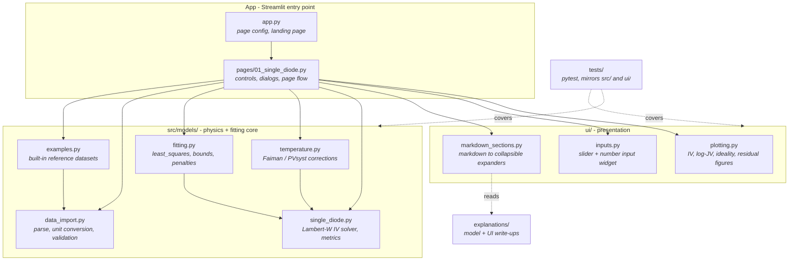

# Diode Fitting

A  web application for plotting, fitting, and analysing IV (current-voltage) curves of solar cells -  from single-diode models through to tandem cell configurations -  as part of the wider **TacOSPV** project at Interface Materials, Oxford.

## Local setup

This project uses a local Python virtual environment named `.venv`.

1. Create it: `python3 -m venv .venv`
2. Activate it (depending on your OS/shell):
	- macOS / Linux (bash/zsh): `source .venv/bin/activate`
	- Windows PowerShell: `.\.venv\Scripts\Activate.ps1`
	- Windows (Command Prompt): `\.venv\Scripts\activate.bat`
3. Install dependencies: `python -m pip install -r requirements.txt`
4. Run Streamlit: `streamlit run app.py`

If you open a new terminal, reactivate the environment before running the app or tests.

---

## Why this? 

- A tandem cell is two single-diode circuits in series, giving 10 free parameters to fit.
- Naive fitting produces good numerical agreement with **parameter degeneracy** -  many different parameter combinations fit equally well, but most of them are physically meaningless (overfitting).
- The core technical challenge of this project is building a fitting approach that penalises unphysical parameter regions heavily, so that a good fit also has a physical interpretation.

---
## Architecture / Repo Structure

The repo is split into three layers: a **physics/maths core** (`src/models/`) that knows nothing about the UI, a **presentation layer** (`ui/`) of reusable Plotly figures and Streamlit widgets, and the **Streamlit app itself** (`app.py` + `pages/`) which wires the two together. Dependencies only ever point downwards - the models are plain NumPy/SciPy and are testable without Streamlit.

| Path | Role |
|---|---|
| `app.py` | Streamlit entry point (`streamlit run app.py`) |
| `pages/` | One file per page; owns layout, state, and dialogs |
| `ui/` | Reusable figures and widgets, no physics |
| `src/models/` | Diode equations, temperature models, fitting, data import |
| `explanations/` | Markdown/PDF write-ups surfaced in-app via `markdown_sections` |
| `tests/` | Pytest suite mirroring `src/` and `ui/` |

---

## Milestones / Phases

### Phase A -  Single diode model (COMPLETED)
Build and validate the base physics: plot IV/JV curves (light and dark) for a single diode equivalent circuit, using an industry-standard temperature dependence model as a placeholder.
- IV curve plotting engine
- JV curve, light and dark conditions
- Standard temperature dependence (Faiman / PVsyst)
- **Milestone:** reproduce a known reference IV curve (e.g. from PV Lighthouse) to within acceptable tolerance

### Phase B - Fitting functionality (COMPLETED)
Add the ability to fit the single-diode model to real/custom data.
- Custom data import (PV Lighthouse-style)
- Baseline fit using an off-the-shelf optimiser
- Parameter bounding + high-cost penalties for unphysical values

#### Review 1 - Documentation of Phase A and Phase B / Testing
- Phase A and B code review
- Phase A and B UI documentation (/ensure clean UX principles are being followed)
- Write unit tests for logic implemneted in phases A, B. 

### Phase C - Tandem extension
Extend the model and fitting pipeline to tandem cells (two diodes in series, ~10 parameters).
- Tandem circuit model (integrating Mikael's method)
- Extended fitting with the larger parameter space
- **Milestone:** fit a tandem IV curve with physically interpretable parameters

### Phase D - Circuit solving (SPICE)
Move to a proper nonlinear circuit solver for speed and scalability.
- PySpice integration (via Google Colab, given the macOS porting issue with TandEx)
- Bridge/compare against the TandEx model
- **Milestone:** TandEx-equivalent circuit solved via PySpice, benchmarked against the direct-equation approach

### Phase E - Paper reproduction
Reproduce the reference Joule paper's results as a way of validating the approach and surfacing solutions to the unphysicality problem.
- **Milestone:** key figures/results from the paper reproduced in this codebase

### Phase F - Deployment
Package the above into a deployable web app.
- Backend API wrapping the model/fitting code
- Frontend for plotting and interactive fitting
- **Milestone:** working deployed app where a user can upload data and get a fitted equivalent circuit

> Full task-by-task breakdown, timeline, and dependencies are in [`IMPLEMENTATION_PLAN.md`](./IMPLEMENTATION_PLAN.md).

---

## Key references

| Resource | Link |
|---|---|
| PV Lighthouse equivalent circuit calculator | https://pvlighthouse.com.au/equivalent-circuit |
| TandEx model (GitHub) | https://github.com/Oxford-eMat-Lab/TandEx |
| Joule paper — tandem conductivity / unphysicality | https://www.cell.com/joule/abstract/S2542-4351(25)00392-7 |
| Faiman module temperature model | https://pvpmc.sandia.gov/modeling-guide/2-dc-module-iv/module-temperature/faiman-module-temperature-model/ |
| PVsyst temperature coefficients | https://www.pvsyst.com/help/component-database/photovoltaics-modules/pv-modules-main-interface/pv-modules-additional-data/temperature-coefficients.html |
| PVsyst one-diode model | https://www.pvsyst.com/help/physical-models-used/pv-module-standard-one-diode-model/index.html?h=diode#as-function-of-the-irradiance |

---
